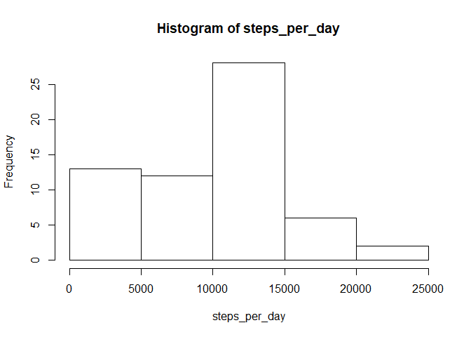

# Reproducible Research: Peer Assessment 1
Costanzo Di Maria  
29 September 2017  


**1. Loading and pre-processing the data.**  
Load the data and apply any transformation needed for subsequent analysis.


```r
fileName <- "activity.zip"
data <- read.csv(unzip(fileName), header=TRUE)
data$date <- as.Date(data$date)
```

**2. What is the mean total number of steps taken per day?**  
Make a histogram of the total number of steps taken each day. Calculate and 
report the mean and median total number of steps taken per day.


```r
steps_per_day <- tapply(data$steps, data$date, sum, na.rm=TRUE)
hist(steps_per_day)
```

<!-- -->

```r
mean_steps <- as.integer(mean(steps_per_day))
median_steps <- as.integer(median(steps_per_day))
```

The mean number of daily steps was 9354; and the 
median was 10395.

**3. What is the average daily activity pattern?**  
Make a time series plot (i.e. type = "l") of the 5-minute interval (x-axis) and 
the average number of steps taken, averaged across all days (y-axis). Which 
5-minute interval, on average across all the days in the dataset, contains the 
maximum number of steps?


```r
steps_by_interval <- tapply(data$steps, data$interval, mean, na.rm=TRUE)
intervals <- as.numeric(names(steps_by_interval))
plot(intervals, steps_by_interval, type="l")
```

<!-- -->

```r
interval_max <- as.numeric(names(which.max(steps_by_interval)))
```

The 5-minute interval containing the maximum number of steps, on average across 
all days, is the interval 835.

**4. Imputing missing values.**  
Calculate and report the total number of missing values in the dataset.
Devise a strategy for filling in all of the missing values in the dataset. The
strategy does not need to be sophisticated. For example, you could use
the mean/median for that day, or the mean for that 5-minute interval, etc.
Create a new dataset that is equal to the original dataset but with the
missing data filled in. Make a histogram of the total number of steps taken each 
day and calculate and report the mean and median total number of steps taken per day. 
Do these values differ from the estimates from the first part of the assignment?
What is the impact of imputing missing data on the estimates of the total
daily number of steps?


```r
n_missing_values <- sum(is.na(data$steps))

# Replace missing value using the mean value for the corresponding 5-minute interval.
data_imputed <- data
n_rows <- dim(data)[1]
for (i in 1:n_rows){
    if (is.na(data$steps[i])){
        interval_name <- as.character(data$interval[i])
        data_imputed$steps[i] <- steps_by_interval[[interval_name]]
    }
}

steps_per_day_imputed <- tapply(data_imputed$steps, data_imputed$date, sum)
hist(steps_per_day_imputed)
```

<!-- -->

```r
mean_steps_imputed <- as.integer(mean(steps_per_day_imputed))
median_steps_imputed <- as.integer(median(steps_per_day_imputed))
```

There are 2304 missing values in the dataset.  
The missing value NA were replaced with the mean value for the corresponding 
5-minute interval. After imputing the missing data, the mean number of daily steps was 
10766; and the median was 10766. For the 
original dataset, the distribution was slightly skewed to the right 
(more small values). After filling in the missing values, the distribution is 
closer to a normal distribution. The mean value increases, and the median value
becomes the same as the mean.

**5. Are there differences in activity patterns between weekdays and weekends?**  
Create a new factor variable in the dataset with two levels - "weekday"
and "weekend" indicating whether a given date is a weekday or weekend
day. Make a panel plot containing a time series plot (i.e. type = "l") of the
5-minute interval (x-axis) and the average number of steps taken, averaged
across all weekday days or weekend days (y-axis).


```r
data_imputed <- data.frame(data_imputed, is_weekend=(weekdays(data_imputed$date) %in% c("Saturday", "Sunday")))
data_weekdays <- subset(data_imputed, is_weekend==FALSE)
data_weekends <- subset(data_imputed, is_weekend==TRUE)
steps_weekdays <- tapply(data_weekdays$steps, data_weekdays$interval, mean)
steps_weekends <- tapply(data_weekends$steps, data_weekends$interval, mean)
par(mfrow=c(2,1))
plot(intervals, steps_weekdays, type="l",
     main="weekdays", ylab="steps_by_interval")
plot(intervals, steps_weekends, type="l",
     main="weekends", ylab="steps_by_interval")
```

<!-- -->
